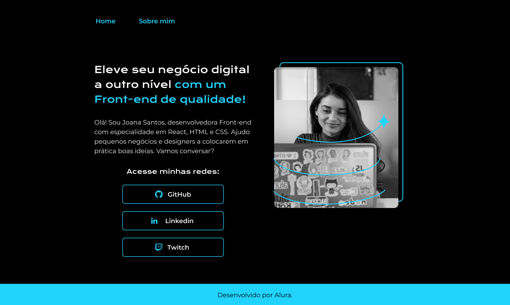

[Projeto Página Web Alura](https://alisson-vml.github.io/projeto_alura_portifolio/)

  

## 💻 Projeto

Projeto de uma pagina web desenvolvida com a Alura

## ✔️ Tecnologias utilizadas

- ``HTML``
- ``CSS``
## 🏷️ Layout

Você pode visualizar o layout do projeto através
[desse link](https://www.figma.com/file/NrzJacC887svMVfF9oC2jM/Portfolio-Projeto-2?type=design&mode=design&t=7JTw0Gt8gzPPgKvh-0).
